# 싸피 플러스

## 4반 1조 심화프로젝트 💂 _**두둥등장**_ 💂

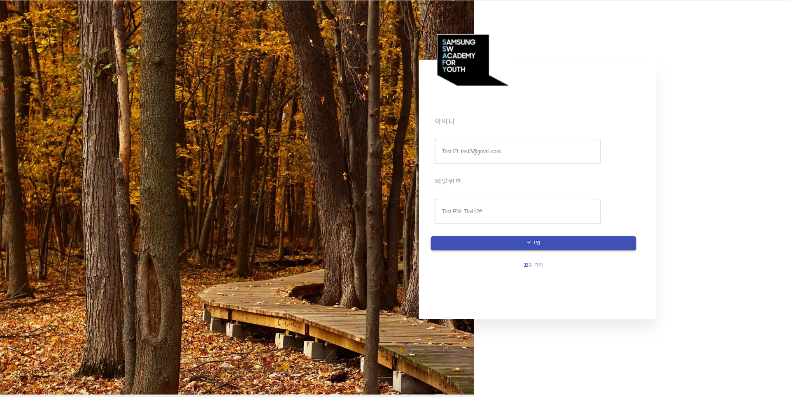

> 프로젝트 개요

```
   싸피생들과 졸업생들이 이용할 수 있는 다목적 공간

   1) 커뮤니티 공간을 통해 졸업생들의 현직자의 삶과 기업정보를 공유합니다.
      - 익명 게시판 활용
      - 한번 싸피는 영원한 싸피! 우리들만의 공간을 만들어 보아요!

   2) 싸피인들만의 스택오버플로우를 제공합니다.
      - 완전 한글화!
      - 해결률 높은 솔루션을 상단에 뜨도록 변화
      - 같은 과정들을 진행하면서 매번 똑같은 질문들을 수십번 반복해서 설명 하시게 되는
        질문자와 컨설턴트님, 코치님, 강사님과 함께 만들어가는 공간!

   3) 자소서, 면접준비, 포트폴리오를 한번에!
      - 여러분이 싸피에 지원하고 입과하시게 된 이유는 ?!  바로 *취업*입니다.
      - 자격증 번호, 취득일, 졸업일등 자소서 양식에 대한 정보들을 한번에 모아볼 수 있는 공간!
      - 에피소드별로 자신의 일대기를 정리해보세요!
      - 이 에피소드는 자소서를 작성하시거나 면접을 준비하실때 큰 도움을 얻으실 수 있어요
      - 정해진 내용을 채우다 보면 자연스럽게 완성되는 아름다운 포트폴리오까지!
```

> board

- 졸업자들도 이용할만한 사이트를 준비 (익명성 자유롭게 부여, 회사들 정보 공유)
- 게시판 만들기를 통해 수 많은 취향을 저격할 수 있는 게시판들을 만들 수 있는 사이트

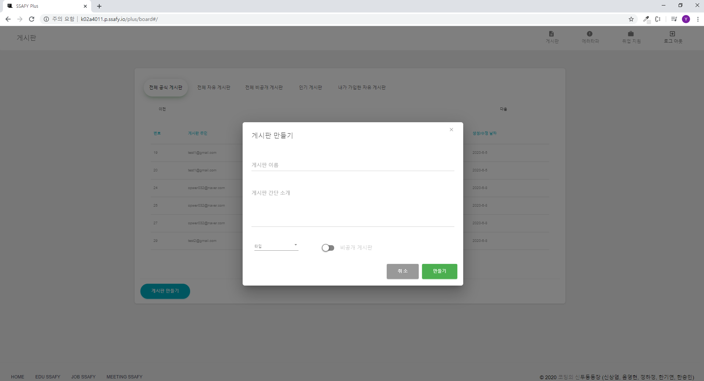
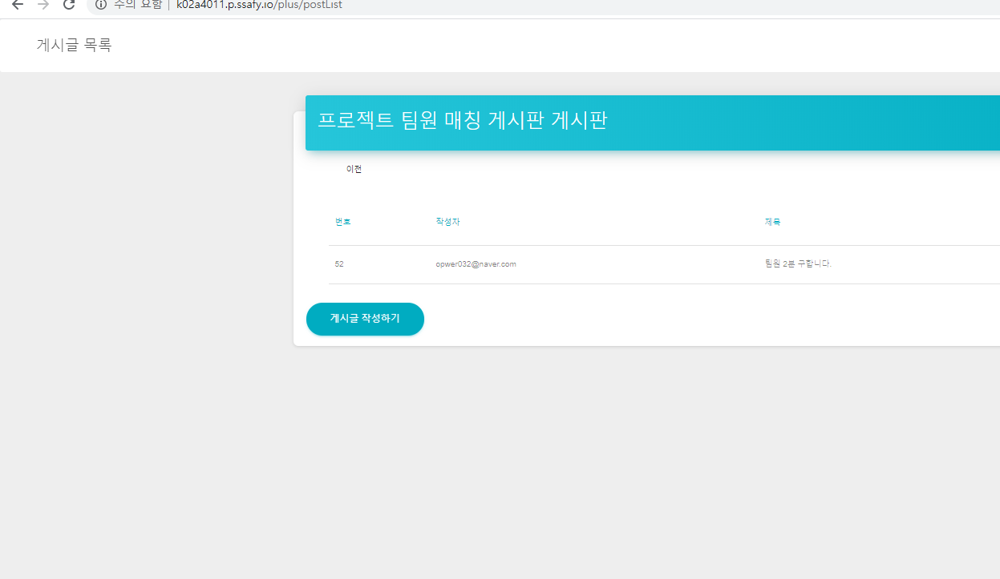

> Debug

- 오류를 질문 양식에 맞추어 등록하고, 코멘트들을 달아 오류를 해결
- 자신에게 적용된 해결방법은 추천 버튼을 만들어 다른 질문보다 상단에 표시될 수 있도록
- 질문 단위로 box화 하여 보기 좋게

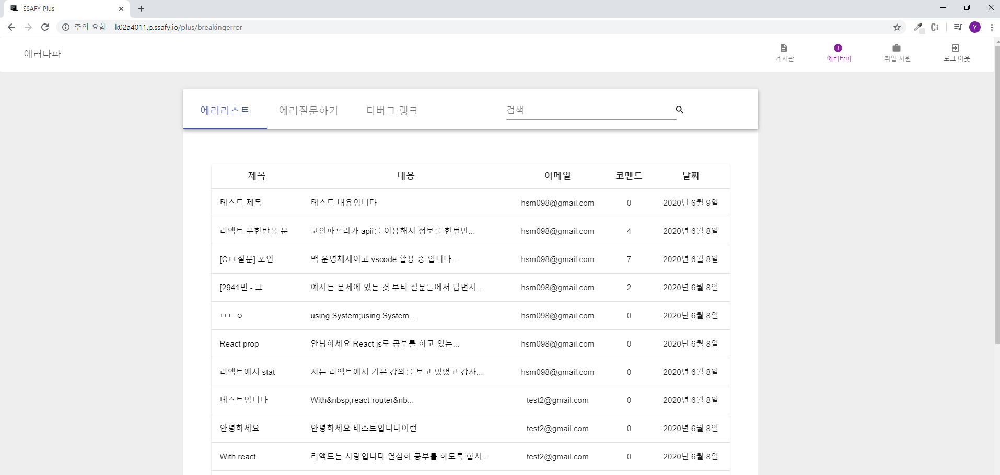
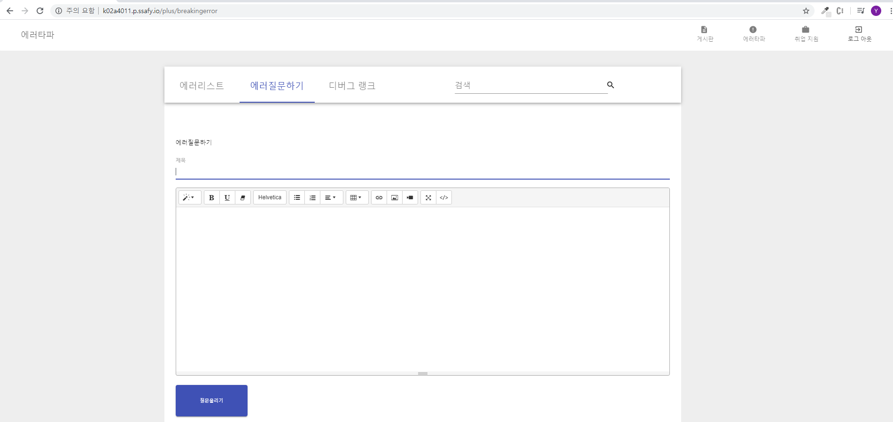

> Job Support

- [career] 자소서, 면접준비 페이지  
  자소서를 작성할 때 이 페이지만 보더라도 작성이 완료될 수 있도록
  많은 정보들을 기입할 수 있게 제작

- [episode]
  에피소드별로, 키워드 별로 정리된 게시글들을 볼 수 있어
  면접준비와 자소서 작성에 도움을 줌

- [portfolio]
  포트폴리오 제작의 최대 걸림돌 \_ 귀찮음
  이를 해결하기 위해 조금씩 질문이 추가되는 형식으로 제작
  질문에 답변하다보면 깔끔한 포트폴리오를 PDF로 다운받을 수 있음

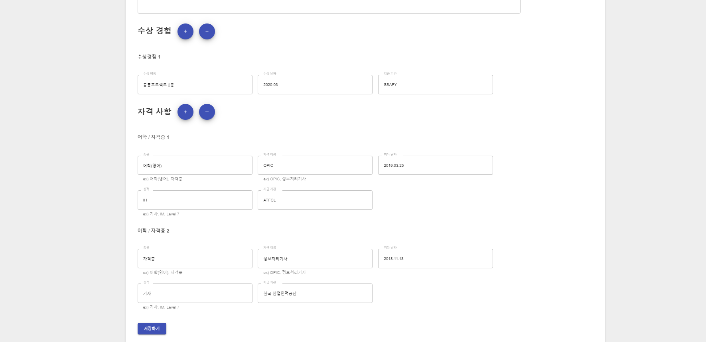
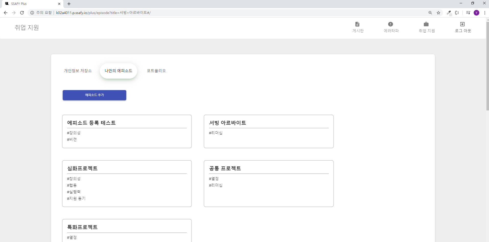

 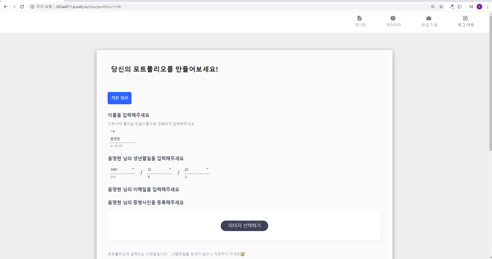
 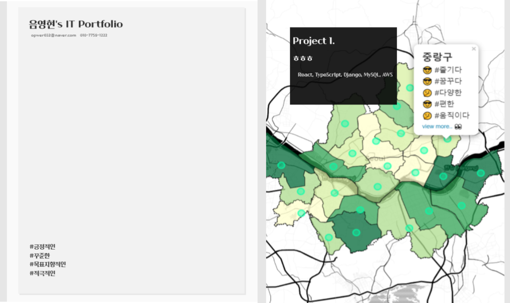

---

---

## 제작 배경

1. 싸피 1기 졸업생 500명 2기 500명
   앞으로 싸피인이 될 인원 대략 8000명(3기부터 10기까지 1000명씩)
   싸피 졸업 후 거의 연락이 없이 지냄
   (약 만명의 같은 개발자를 희망하는 대규모 인적 자원 및 동호회)
   블라인드와 같은 단순 자기 회사 기업 정보를 이야기 하는 사이트 성황리 서비스
   --> 기업 정보, 이직 정보등 졸업생들도 활용 가능하게

2. 싸피의 보안 절차 때문에 개인 깃 헙 이나 개인 블로그, 포트폴리오를 활용하지 못함
   졸업 취업자들의 이직용 포트폴리오  
   취업 희망자들의 포트폴리오
   --> 새로운 프로젝트를 시작하기 전이나, 스터디를 구성할때 도움 될 수 있게

3. 물어볼 것이 있지만 컨설턴트님, 코치님, 1학기 강사님의 한계 --> 질문을 할 떄 대부분의 학생이 상세히 상황을 설명하지 못하고, 수많은 스택들을 질문하다 보니 힘드실것으로 예상
   같은 학생들도 뛰어난 학생들이 있음, 참여율을 높이자 --> 질문에 대한 답을 해주는것이 포트폴리오의 하나의 업적으로 남게 진행
   (ex. 백준 온라인 저지의 바킹독 과 같은 사람들, 많이 풀고 질의 응답 많이 하시면서 유명해짐)

4. 수업 시간에 배운것들, 플젝하면서 공부한 것들을 정리 해서 공유(익명 게시판 정보 게시판 초창기에 활발했지만 사용안하는 이유는 포인트에 관심 없어서)
   각 기수 별로 다른 페이지를 운영 하기에 1기와 2기의 정보 공유 글 없어진다.
   --> 강사님, 컨설턴트님, 코치님의 확인을 통해 신뢰성 있는 글이면 업적 부여등, 신뢰성을 높이는게 최우선

### 기타 사항

> 사용 스택

   
   
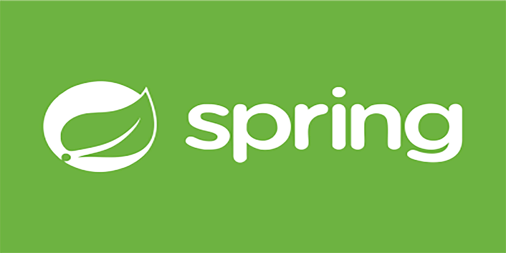   
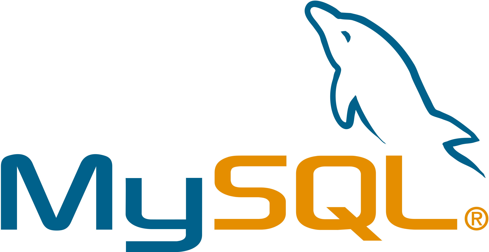     
    

   
> ERD

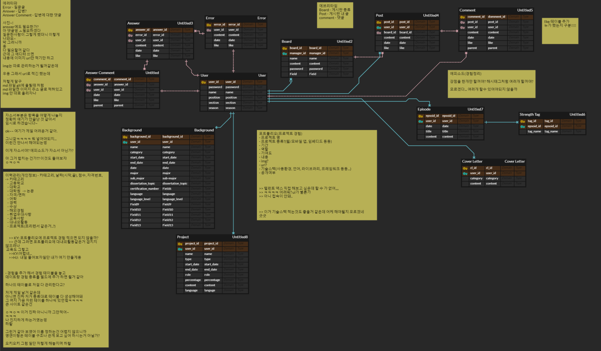

#### 프론트엔드 - React, TypeScript

- 신상엽 (게시판) https://lab.ssafy.com/ssyup4259
- 음영현 (취업지원, 로그인) https://lab.ssafy.com/Eum_mericano
- 한승민 (에러 타파) https://lab.ssafy.com/hanseungmin

#### 백엔드 - Spring, Mysql

- 정하정 (에러타파 API, 쉘 스크립팅, UCC 제작) https://lab.ssafy.com/summ3r119
- 한기연 (게시판, 로그인, 취업지원 API. UCC제작) https://lab.ssafy.com/kiyeon

---

커밋 룰

20200508 | 내용 | 음영현

master  
 ㄴ1) develop  
 . ㄴ2) frontend  
 . ㄴ2) backend

기능별 브랜치 작성

ex) login 페이지 백엔드 작업
branch명: backend_login
